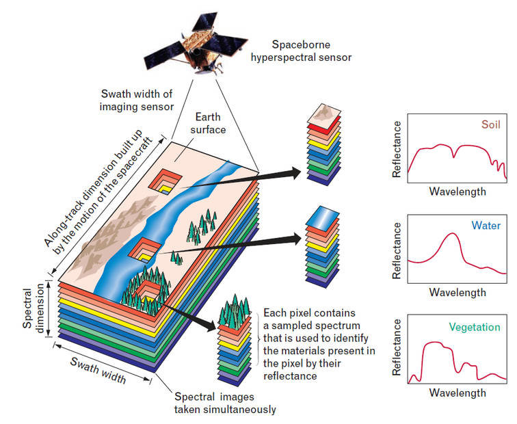
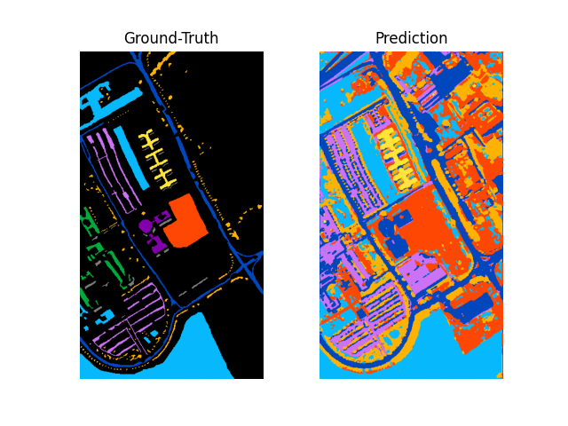

# Hyperspectral Image Classification

## Get started

### Installation

First download the repository.

Then install the requirements from the designated file.

```
pip install requirements.txt
```

## Demonstration

### Context

Hyperspectral (HS) data is a specific kind of image that carries much more data than a typical image.
Dedicated sensors, such as the AVIRIS or ROSIS ones, capture a wider part of the electromagnetic spectrum.

Usually, a pixel is described as an array of 3 values, namely the Red, Green and Blue components. However, hyperspectral (HS) data depicts pixels with more than a hundred components.
One such  HS sensor scans its environment and selects bandwiths of the electromagnetic spectrum. The spectral resolution is used to set how often the sensor does so along the spectrum.



Thanks to this lot of data, much information can be deduced on one image.
This projects was inspired from this [paper](https://paperswithcode.com/paper/spectral-spatial-classification-of-2), released in 2017. It aims at classifying terrain from an aerial picture, as of a campus in Italy, called the Pavia University.
The said aerial scene is depicted as follows :


The ROSIS (Reflective Optics System Imaging Spectrometer) sensor was used to capture the data, for a total of 103 spectral bands ranging from 0.43 to 0.86µm. This image is restricted to the visible light spectrum, but it can go far beyond for other HS images.

### Results

First results without specific training methods lead to ~89% correct guesses. Further work should aim at improving that.



The least represented classes are the ones the model struggles the most on, like gravel and shadows. Otherwise, the model tends to generalize well over the rest of the image.


### Training

```
python main.py --data ./data/pavia_university/data.yaml --nn_mode 2D --train
```

### Evaluation

```
python main.py --data ./data/pavia_university/data.yaml --nn_mode 2D --resume path_to_model --full_map
```

# Acknowledgements

<details>
<summary>Expand</summary>

* [Papers with Code - Reference Paper](https://paperswithcode.com/paper/spectral-spatial-classification-of-2)
* [Research Gate - Hyperspectral Image Decomposition](https://www.researchgate.net/figure/Hyperspectral-image-concept-Multi-variate-image-with-simultaneous-access-to-spectral_fig4_278786166)
</details>
