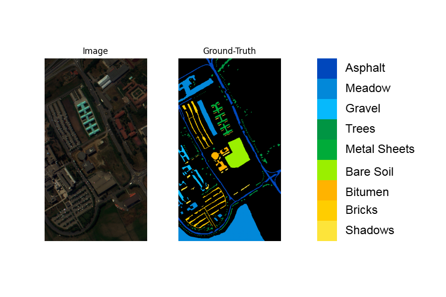

# Hyperspectral Imagery Classification

## Get started

### Installation

First download the repository.\n
Then install the requirements from the designated file.

```
pip install requirements.txt
```

## Demonstration

Hyperspectral (HS) data is a specific kind of image that carries much more data than a typical image.\n
Dedicated sensors, such as the AVIRIS or ROSIS ones, capture a wider part of the electromagnetic spectrum.\n\n

Usually, a pixel is described as an array of 3 values, namely the Red, Green and Blue components. However, hyperspectral (HS) data depicts pixels with more than a hundred components.\n
One such  HS sensor scans its environment and selects bandwiths of the electromagnetic spectrum. The spectral resolution is used to set how often the sensor does so along the spectrum.\n\n

Thanks to this lot of data, much information can be deduced on one image.\n
This projects was inspired from a paper released in 2017. It aims at classifying terrain from an aerial picture, as of a campus in Italy, called the Pavia University.\n
The said aerial scene is depicted as follows :



The ROSIS (Reflective Optics System Imaging Spectrometer) sensor was used to capture the data, for a total of 103 spectral bands ranging from 0.43 to 0.86µm.


### Training

```
python main.py --data ./data/pavia_university/data.yaml --nn_mode 2D --train
```

### Evaluation

```
python main.py --data ./data/pavia_university/data.yaml --nn_mode 2D --resume path_to_model --full_map
```
